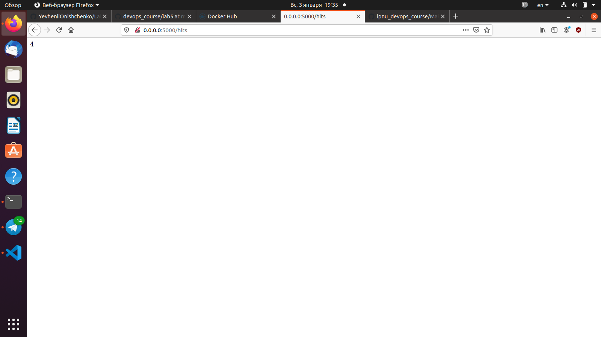
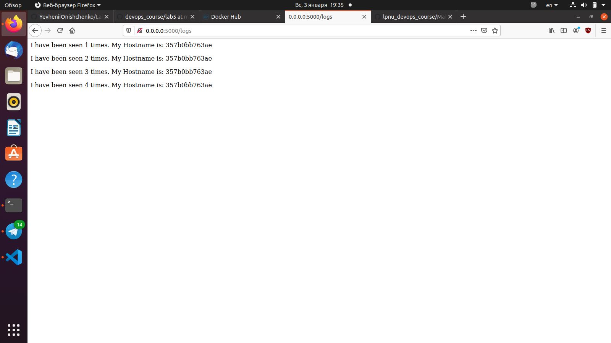

## Lab 5
1. Using commands `pipenv --python 3.8`, `pipenv install -r requirements.txt`, `pipenv run python app.py`
 When the last command did not work I ran `sudo docker run --rm --net=host -it -p 6379:6379 redis`
2. Using command `pipenv run pytest test_app.py --url http://localhost:5000`  
Tests did not work because directory logs had not existed. After creating it, all 4 tests passed.
### Makefile
3. Makefile  
run - runs site and redis server  
test-app - runs tests  
docker-prune - clears all conteiners and images
4. Using command `sudo make app tests` 
5. Using command `sudo docker network rm appnet` to remove previous network
6. Using commands `sudo make run`, `sudo make test-app`  
  
  

7. Using command `sudo make docker-prune` 
8. Adding `docker-push` directive in Makefile
### docker-compose
9. First network public is used for interaction with site. Second network secret is used only for redis because of nobody could access from outside. 
10. Using command `sudo docker-compose -p lab_5 up` 
11. We must write 0.0.0.0 address 
12. Using command `sudo docker-compose down`
13. Using command `sudo docker-compose push`  
As for me, it is better to use Makefile. Its structure is clearer for me and there is ability to clean containers and images. 