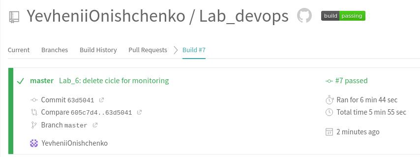

## lab_6
link to Travis repository https://travis-ci.com/github/YevheniiOnishchenko/Lab_devops  
1. Connecting git repository to Travis
2. Creating file .travis.yml
3. Running build in Travis
4. Changing lab_2 build, changing tests, adding scripts directory 
5. Changing lab_3 build, deleting cycle for monitoring
6. Running build in Travis
 
